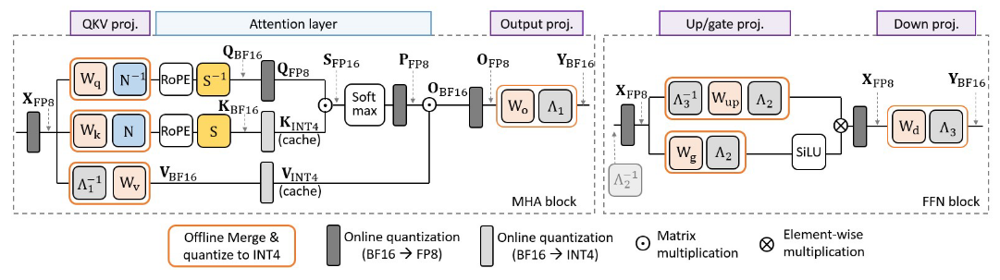
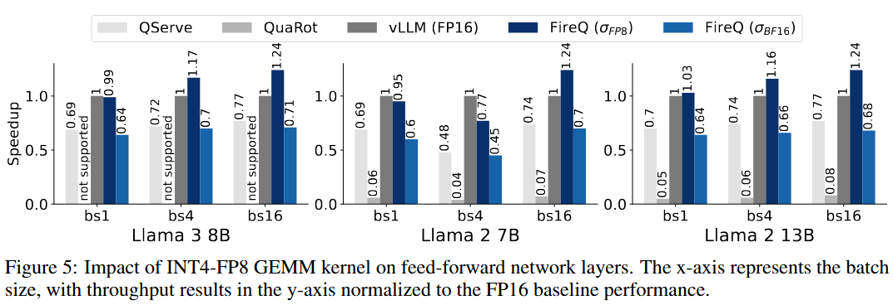
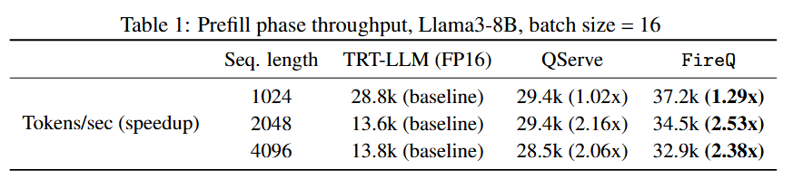
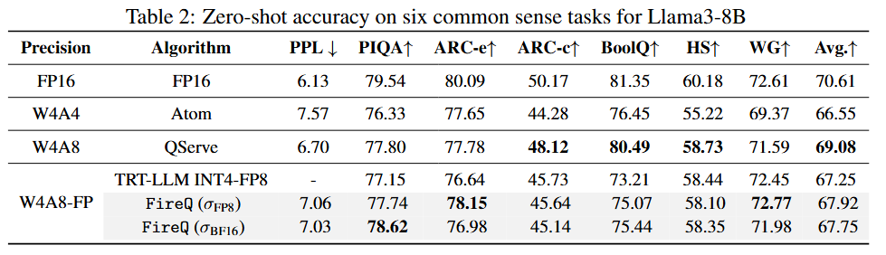

# 🔥FireQ: Fast INT4-FP8 Kernel and RoPE-aware Quantization for LLM Inference Accelerattion

We propose FireQ, a co-designed PTQ framework and an INT4-FP8 matrix multiplication kernel that accelerates LLM inference across all linear layers. Specifically, FireQ quantizes linear layer weights and key-values to INT4, and activations and queries to FP8, significantly enhancing throughput. Additionally, we introduce a three-stage pipelining for the prefill phase, which modifies the FlashAttention-3 kernel, effectively reducing time-to-first-token in
the prefill phase. 



To minimize accuracy loss from quantization, we develop novel
outlier smoothing techniques tailored separately for linear and attention layers.
In linear layers, we explicitly use per-tensor scaling to prevent underflow caused
by the FP8 quantization scaling factor of INT4 quantization, and channel-wise
scaling to compensate for INT4’s coarse granularity. In attention layers, we address
quantization challenges posed by rotary positional embeddings (RoPE) by combin-
ing pre-RoPE and post-RoPE scaling strategies.  


## Requirements & Installation

> **Environments**  
> These codes and following scripts have been validated in NVIDIA H100, Linux Ubuntu22.04  
> python 3.10.x  
> torch 2.6.0  

To install requirements:

```setup
pip install -r requirements.txt
pip install -e . --verbose && mv *.so mcomp/fused/kernels/libs
```

## Quantization Examples

To quantize a model

```python

import torch
from transformers import AutoConfig, AutoModelForCausalLM, AutoTokenizer

## Load Model 
model_path = 'meta-llama/Llama-3.1-8B'
model = AutoModelForCausalLM.from_pretrained(model_path, 
                                             torch_dtype=torch.bfloat16,
                                             local_files_only=True,
                                            )

tokenizer = AutoTokenizer.from_pretrained(model_path, local_files_only=True)

## Load Quantization Configuration in yaml
from mcomp.config.configs import Config
yaml_paths = ['quant_configs/llama3_quant.yaml', 'quant_configs/llama/llama3.yaml']
config, invalid_data, rem0ain_data = Config.get_config_from_yamls(yaml_paths)

## Quantizer Instance
from mcomp.quant.fireQLlamaQuantizer import FireQLlamaQuantizer
quantizer = FireQLlamaQuantizer(model, tokenizer, config, 'cuda')
quantizer.quantize_model()

print(model)
```


## Evaluation

To evaluate FireQ, run:

```bash
# Make Llama-3-8B quantized & PPL, zero-shot scores
# chmod+x if needed
cd examples
./quant_model.sh # weight:int4/fp8, activation:fp8/bf16    
./quant_model_i4_f8.sh # weight:int4/bf16, activation:fp8/bf16  

## ./quant_model.sh should be executed first for quantized model to get ready.
# MLP
cd benchmarks

./scripts/run_mlp_benchmark.sh
./scripts/run_prefill_benchmark.sh
./scripts/run_linear_benchmark.sh
```


## Results

Our model achieves the following performance:







## Examples

  1. [Config setup](#1-config-setup)
  2. [Quantize](#2-making-a-model-quantized)
  3. [Save Model](#3-save-a-quantized-model)
  4. [Load Model](#4-load-a-quantized-model)
  5. [Fuse Model](#5-model-fuser)
  6. [KVCache Examples](#6-kvcache-usage-examples-as-for-now)


### 1. Config setup

Quantization-related configurations are defined in the form of yaml.
 - `model_type`: Decoder block's morphology.
 - `adds_mappings`: calibrations (add-ons)
    - orientation: 
      - 2 (10) input-side
      - 1 (01) output-side
      - 0 (00) online-calibration
 - `layer_quant_configs`: Attention or MLP layer types to be applied into a model
 - `quant`: Quantization algorithms, Quantization blocks that consist of above `layer_quant_configs`.
 - `model_quant_mapping`: Indices of the decoder blocks that maps from *`quant`.Quantization blocks*
 - `calib_data`: Calibration data
 - ...

Configurations can be defined in separated yaml files.


### 2. Making a model quantized

```python

import torch
from transformers import AutoConfig, AutoModelForCausalLM, AutoTokenizer

## Load Model 
model_path = 'meta-llama/Llama-3.1-8B'
model = AutoModelForCausalLM.from_pretrained(model_path, 
                                             torch_dtype=torch.bfloat16,
                                             local_files_only=True,
                                            )

tokenizer = AutoTokenizer.from_pretrained(model_path, local_files_only=True)

## Load Quantization Configuration in yaml
from mcomp.config.configs import Config
yaml_paths = ['quant_configs/llama3_quant.yaml', 'quant_configs/llama/llama3.yaml']
config, invalid_data, remain_data = Config.get_config_from_yamls(yaml_paths)

## Quantizer Instance
from mcomp.quant.fireQLlamaQuantizer import FireQLlamaQuantizer
quantizer = FireQLlamaQuantizer(model, tokenizer, config, 'cuda')
quantizer.quantize_model()

print(model)

```

### 3. Save a quantized model

If `$HF_HOME` is defined. The saved model will be located in the `$HF_HOME/hub/`

```python

save_path = 'llama3.1-8B-Quant'
quantizer.save_quantized(save_path)
```


### 4. Load a quantized model

```python
import torch
from mcomp.quant.fireQLlamaQuantizer import FireQLlamaQuantizer

save_path = 'llama3.1-8B-Quant'

quantizer, model, tokenizer = FireQLlamaQuantizer.load_quantized(save_path)

```


### 5. Model Fuser

```python

from mcomp.fused.modules.models.llama.fuser import LlamaFuser
LlamaFuser(model, quantizer.config).fuse()

```

### 6. KVCache usage examples as for now

```python

from mcomp.quant.modules.cache import PseudoQuantStaticCache

kv_cache = PseudoQuantStaticCache(nbits=4,
                                      model_config=model.config,
                                      batch_size=4,
                                      max_cache_len=16384,
                                      dtype=model.dtype,
                                  scale_dtype=torch.float8_e4m3fn,
                                 device='cuda')

output = model.generate(**cuda_inps, past_key_values=kv_cache, max_new_tokens=256)

```
